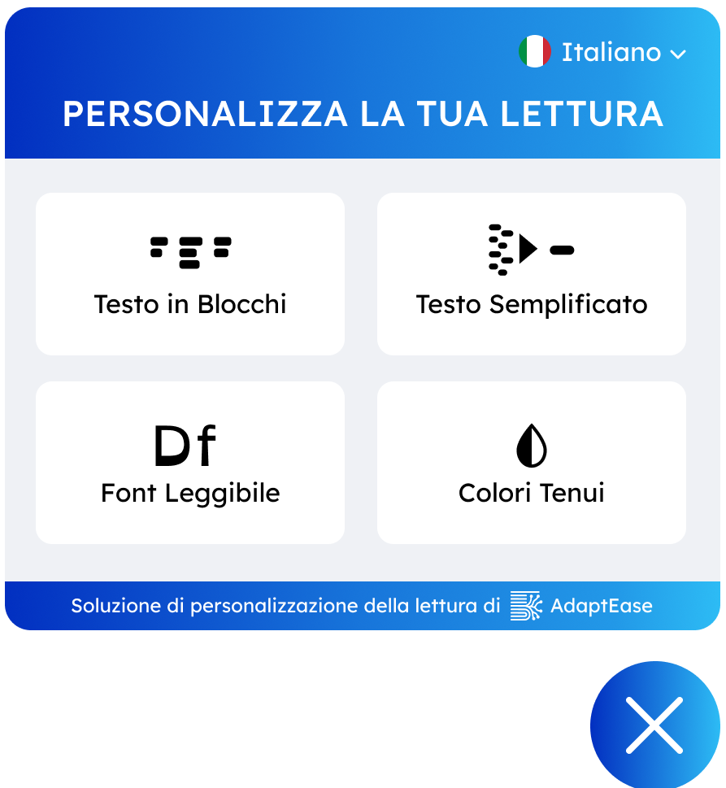
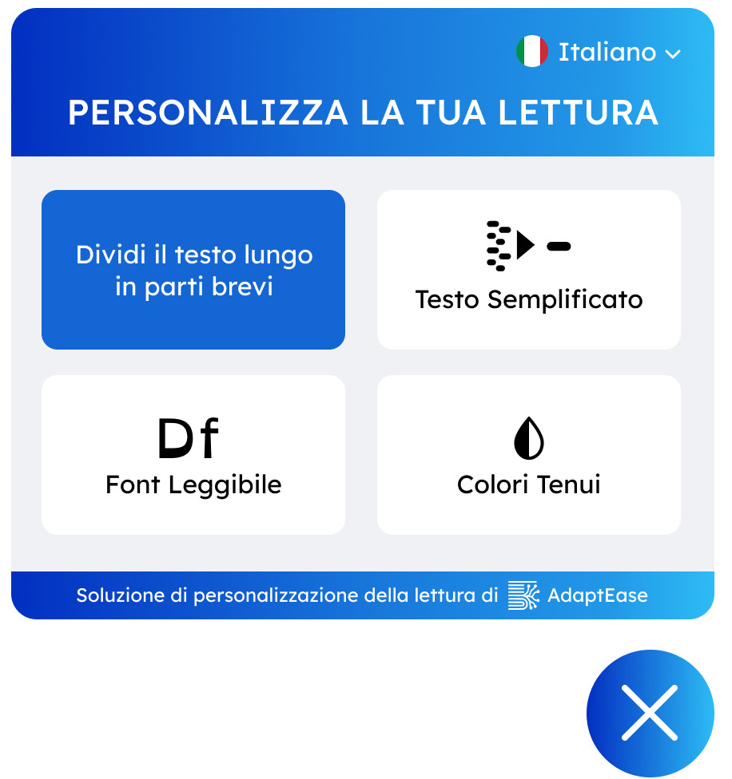
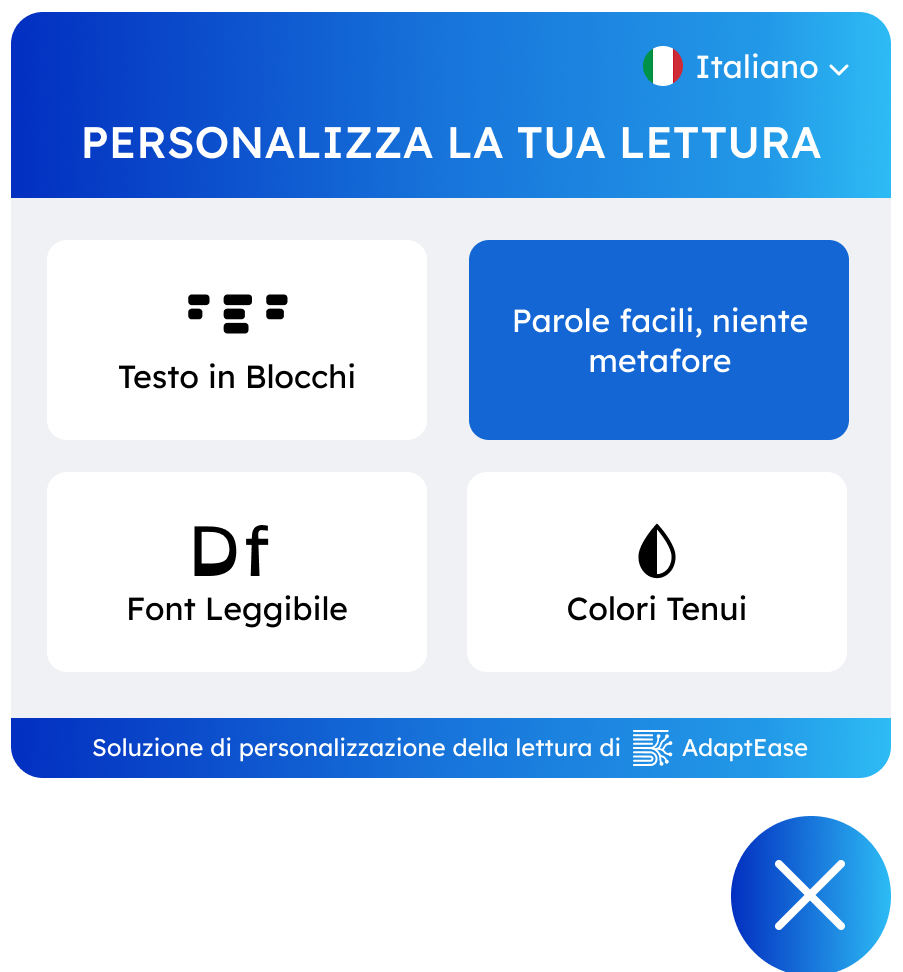
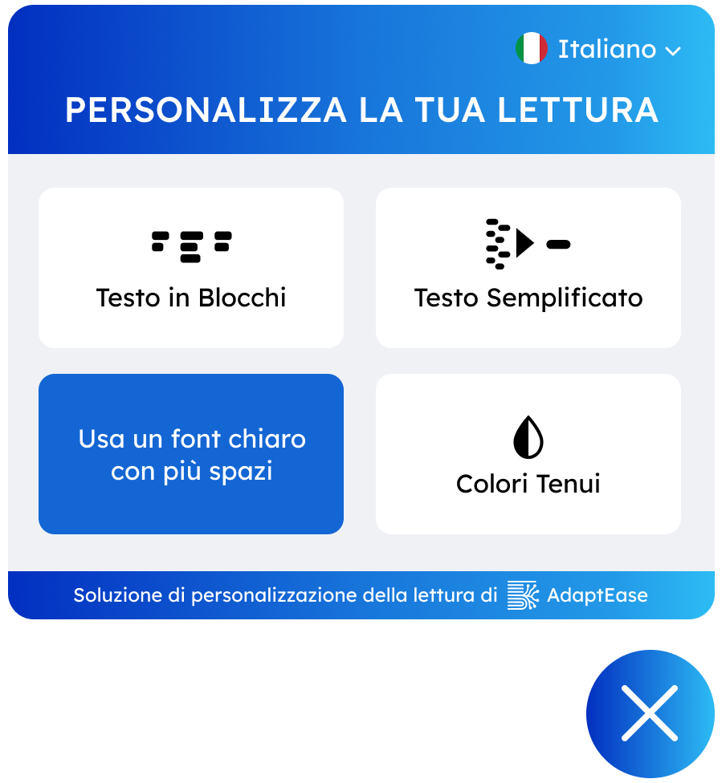
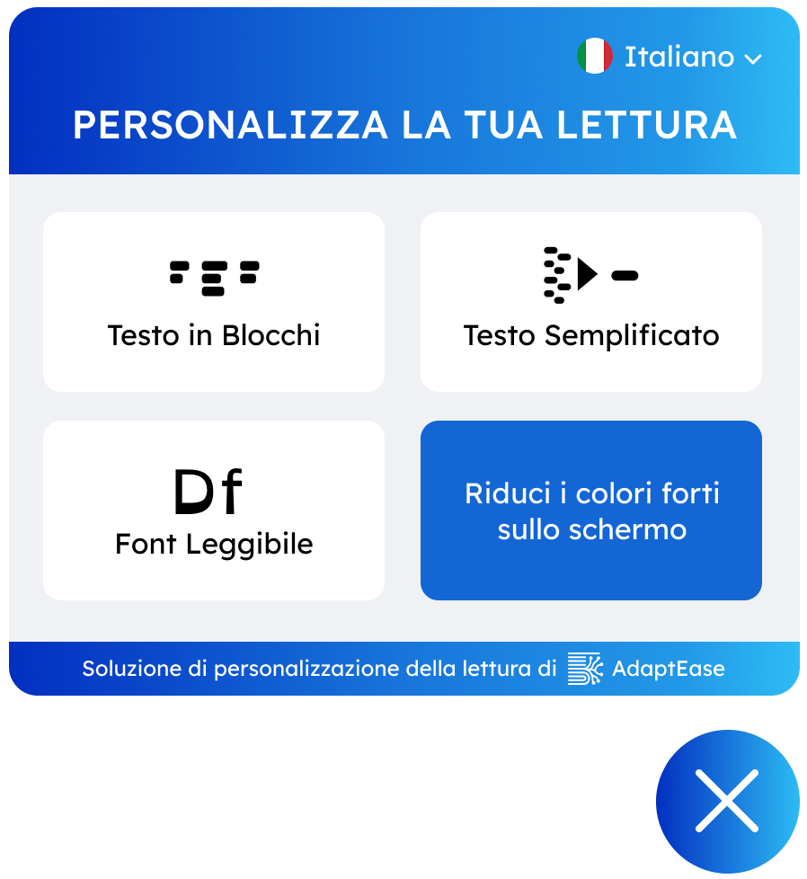
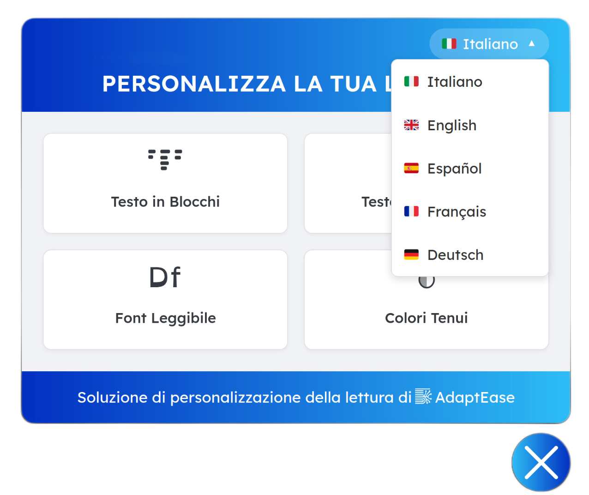

# AdaptEase: Revolutionizing Web Accessibility


[](https://opensource.org/licenses/MIT)

AdaptEase is an **AI-powered widget** designed to create a truly **inclusive reading experience** online. Primarily developed for **neurodivergent individuals** (dyslexia, ADHD, autism) but beneficial for all, it enables **real-time customization** of digital content for enhanced **clarity, readability, and accessibility**.

It features four key cognitive functions: **text chunking, linguistic simplification, a dyslexic font with increased spacing, and visual stimulation reduction (soft colors)**. AdaptEase seamlessly enhances reading on any website, supporting **multiple languages** without altering original content structure.

This **lightweight, scalable solution** integrates with just **one line of code**. Its frontend directly manipulates the DOM, while the **Flask-based backend** leverages **optimized open-source LLMs (Qwen)** for fast, cached, **multilingual inference**. All features are grounded in **scientific evidence** and **W3C cognitive accessibility standards**, ensuring real impact.

AdaptEase empowers **publishers, brands, and platforms** to offer more inclusive content, boosting **dwell time, reducing bounce rates, and strengthening ESG, SEO, and compliance** (Accessibility Act 2025).

*This project was developed for the [Codemotion Digital Editorial Revolution Hackathon](https://events.codemotion.com/hackathons/digital-editorial-revolution/home).*

---

## What AdaptEase Does

AdaptEase integrates seamlessly into any HTML page, offering a dynamic set of tools to improve readability and visual comfort. Below are the core functionalities, powered by an intelligent Python backend:

### 1. Text in Blocks (Chunking)

*   **What it does:** This feature intelligently breaks down long, dense paragraphs into smaller, more manageable blocks of text. Utilizing a powerful Language Model (LLM) running on the backend, AdaptEase analyzes the content and re-structures it into digestible segments. It also provides the capability to split content into "plain" and "highlighted" sections for specific use cases.
*   **Why it's important to the user:** Large blocks of text can be overwhelming and difficult to read, especially for individuals with cognitive load challenges, attention deficits, or those who prefer bite-sized information. Chunking improves scannability, reduces cognitive fatigue, and helps users focus on one idea at a time, leading to better comprehension.

### 2. Simplified Text

*   **What it does:** Leveraging the advanced capabilities of a large Language Model (LLM) (specifically, the Qwen model), the "Simplified Text" feature rewrites complex sentences and paragraphs into simpler, easier-to-understand language. It aims to remove jargon, convoluted sentence structures, metaphors, and abstract concepts, replacing them with more straightforward vocabulary and phrasing.
*   **Why it's important to the user:** Complex language can be a significant barrier to information access for many, including non-native speakers, individuals with reading disabilities (like dyslexia), or those with limited literacy. Text simplification makes content accessible to a broader demographic, fostering greater understanding and engagement with your content.

### 3. Readable Font

*   **What it does:** This feature applies a set of dyslexic-friendly fonts (primarily OpenDyslexic, with Lexend as a strong alternative) to the page's text content. In addition to changing the typeface, it also increases word spacing (`0.5em`), which is known to improve readability for some individuals by reducing letter crowding.
*   **Why it's important to the user:** Certain fonts and increased word spacing can significantly enhance readability for people with dyslexia by making character recognition easier. This feature provides a more comfortable and effective reading experience, reducing the strain often associated with reading traditional text.

### 4. Soft Colors (Desaturate Colors)

*   **What it does:** The "Soft Colors" feature adjusts the overall color scheme of the webpage to a softer, less intense palette. This is achieved by dynamically applying a CSS class (`adaptease-soft-colors-active`) to the `<html>` element, which then modifies background colors, text colors, and potentially other UI elements to reduce harsh contrasts and brightness.
*   **Why it's important to the user:** Bright, high-contrast colors can cause eye strain, glare, and discomfort, especially during prolonged reading or for individuals with light sensitivity, visual impairments, or certain neurological conditions. Soft colors create a more calming and gentle visual environment, reducing visual fatigue and making the content easier on the eyes for extended periods.

---

## AdaptEase in Action: A Visual Showcase

Experience AdaptEase firsthand through these visual examples of the widget's interface and features.

### Main Widget Screen

This image displays the primary AdaptEase menu when it is open, showcasing the available accessibility features.

<div align="center">

</div>

### Feature Buttons Highlighted

Each image below shows one of AdaptEase's powerful features being activated, with its corresponding button highlighted to indicate its active state.

| Text in Blocks | Simplified Text | Readable Font | Soft Colors |
|----------------|-----------------|---------------|-------------|
|  |  |  |  |

### Language Selection

AdaptEase provides robust multilingual support, allowing users to switch between languages effortlessly. Click the language button in the top right to reveal the dropdown:

<div align="center">

</div>
---

## Language Scalability & Customization

AdaptEase is designed with **multilingual scalability** in mind, making it easy to extend support to your preferred languages. To add a new language, you need to perform the following steps:

1.  **Modify `adaptease.html`**: Add a new `div` element within the `languageDropdown` with the `awm-v2-language-option` class and a `data-lang` attribute set to your new language's ISO 639-1 code (e.g., `data-lang="fr"` for French).
    ```html
    <!-- Example for adding a French option in adaptease.html -->
    <div class="awm-v2-language-option" data-lang="fr" role="option">
        <span class="awm-flag-icon">🇫🇷</span> Français
    </div>
    ```

2.  **Update `assets/adaptease_translations.json`**: Add a new top-level key corresponding to your language's ISO code (e.g., `"fr"`) and provide translations for all UI text elements used by the widget. This ensures buttons, labels, and messages are displayed in the new language.

3.  **Add Language Prompts to `assets/prompts/`**: For the "Text in Blocks" (chunking) and "Simplified Text" features, you will need to create new prompt files for your language in the `assets/prompts/` directory. These files (`chunk_prompts.json` and `simplify_prompts.json`) are crucial for guiding the Language Model's behavior in your specific language. The structure should mirror the existing prompt files (e.g., `assets/prompts/en_chunk_prompts.json`, `assets/prompts/en_simplify_prompts.json`), but with content tailored for your new language.

By following these steps, you can significantly expand AdaptEase's linguistic capabilities, making it even more adaptable to global audiences.

---

## How to Use AdaptEase

Integrating AdaptEase into your existing HTML page is incredibly simple, embodying our slogan: **AdaptEase: It's EASY TO ADAPT!**

The widget handles its own HTML and CSS injection, requiring minimal setup on your part. The most crucial step is to tell AdaptEase which elements on your page contain the text it needs to process or modify.

1.  **Include the Script:** Place the following `<script>` tag right before the closing `</body>` tag in your HTML file:

    ```html
    <!-- 
        AdaptEase Widget Script Injection 
        - src: Path to your adaptease.js file.
        - type="module": Important for modern JavaScript, allows import/export.
        - defer: Ensures the script executes after the HTML is parsed but before DOMContentLoaded.
        - data-adaptease-text-class: Specifies the CSS selector for the text elements
                                        the widget should target.
    -->
    <script src="adaptease.js" 
            type="module" 
            defer
            data-adaptease-text-class=".foc-module-text p">
    </script>
    ```

2.  **Configure Your Text Container (`data-adaptease-text-class`):**
    The key to AdaptEase's adaptability is the `data-adaptease-text-class` attribute within the script tag. You **only** need to change the value of this attribute to the CSS selector that precisely targets the text elements you want AdaptEase to work with.

    *   **Example:** If your main article content is wrapped in a `<div id="article-body">` and paragraphs are within it, you might use `data-adaptease-text-class="#article-body p"`.
    *   **Your current configuration:** As seen in `index_focus.html`, it's set to `data-adaptease-text-class=".foc-module-text p"`, which targets all `<p>` tags located within elements that have the class `foc-module-text`.

    This minimal configuration ensures AdaptEase seamlessly integrates into your existing web ecosystem without requiring extensive modifications to your page's structure or styles.

---

## Project Structure

The AdaptEase project is organized into logical components to ensure modularity and maintainability:

*   `server.py`: The Flask backend application handling API endpoints for text processing (chunking and simplification).
*   `model.py`: Contains the core logic for interacting with the Language Model (LLM), including text chunking and simplification functions. This is where the Hugging Face Transformers library and the Qwen model are utilized.
*   `adaptease.js`: The main client-side JavaScript file responsible for injecting the widget's HTML, CSS, handling user interactions, making API calls to the backend, and dynamically applying accessibility features.
*   `adaptease.html`: Defines the HTML structure of the accessibility widget's user interface.
*   `adaptease.css`: Provides the styling for the widget's UI elements and the visual modifications applied by features like "Soft Colors".
*   `icons.js`: Stores SVG icon strings used throughout the widget's interface for buttons and branding.
*   `assets/`: This directory holds various static assets:
    *   `assets/prompts/`: Contains JSON files (`chunk_prompts.json`, `simplify_prompts.json`) with carefully crafted prompts for the Language Model, supporting multiple languages.
    *   `assets/fonts/opendyslexic/`: Stores the OpenDyslexic font files used by the "Readable Font" feature.
    *   `assets/adaptease_translations.json`: A JSON file containing all UI text translations for the widget in various languages.
    *   `assets/images/`: (New) Suggested directory for screenshots and other image assets used in the README.

---

## Technologies Used

*   **Backend:**
    *   **Python 3.x:** The core language for the backend API and LLM interaction.
    *   **Flask:** A lightweight and flexible web framework used to build the RESTful API endpoints.
    *   **Flask-CORS:** Enables Cross-Origin Resource Sharing for seamless communication between the frontend and backend.
    *   **PyTorch:** A powerful open-source machine learning framework used for efficient LLM inference.
    *   **Hugging Face Transformers:** A library providing pre-trained models, tokenizers, and utilities for natural language processing, specifically used for the Qwen LLM.
    *   **Qwen/Qwen3-32B:** The large Language Model from Hugging Face employed for sophisticated text chunking and simplification.
*   **Frontend:**
    *   **HTML5, CSS3, JavaScript (ES Modules):** Standard web technologies for building the interactive widget.
    *   **Lottie Player:** A web component used for displaying smooth, resolution-independent animations (e.g., loading spinners).
    *   **OpenDyslexic Font:** An open-source font specifically designed to aid readers with dyslexia, integrated via custom `@font-face` rules.
    *   **Lexend Font:** A variable font optimized for readability, also included in the font stack for the "Readable Font" feature.

---

## Installation and Setup

To run AdaptEase locally and contribute to its development, follow these steps:

1.  **Clone the repository:**
    ```bash
    git clone https://github.com/your-username/adaptease.git
    cd adaptease/ita # Or the specific directory containing server.py
    ```

2.  **Backend Setup (Python):**
    *   **Create a Virtual Environment:**
        ```bash
        python -m venv venv
        source venv/bin/activate # On Windows: .\venv\Scripts\activate
        ```
    *   **Install Dependencies:** Create a `requirements.txt` file in the same directory as `server.py` with the following content, then install:
        ```
        flask
        flask-cors
        torch # Ensure you install the correct PyTorch version for your system/CUDA
        transformers
        sentencepiece # Often a dependency for transformers
        accelerate # Often helpful for large models
        ```
        ```bash
        pip install -r requirements.txt
        ```
    *   **Hugging Face Token:** The `model.py` requires a Hugging Face authentication token (`HF_TOKEN`) to download and use the Qwen model. Set this as an environment variable:
        ```bash
        export HF_TOKEN="hf_YOUR_ACTUAL_HUGGING_FACE_TOKEN_HERE"
        # For persistent setup, add this line to your shell's profile file (e.g., ~/.bashrc, ~/.zshrc)
        ```
        Replace `hf_YOUR_ACTUAL_HUGGING_FACE_TOKEN_HERE` with your personal Hugging Face user access token (which can be generated in your Hugging Face settings).
    *   **Run the Flask Server:**
        ```bash
        python server.py
        ```
        The server will start and typically be accessible at `http://0.0.0.0:5000`.

3.  **Frontend Setup:**
    *   Ensure all frontend assets (`adaptease.js`, `adaptease.html`, `adaptease.css`, `icons.js`, and the entire `assets` folder including `prompts`, `fonts`, `translations`, and your new `images` folder) are placed in a location accessible by your web server or directly relative to your HTML page.
    *   Include the `adaptease.js` script tag in your HTML file as demonstrated in the "How to Use AdaptEase" section, remembering to adjust the `data-adaptease-text-class` attribute to match your target text elements.

---

## Future Enhancements & Roadmap

We are continuously working to improve AdaptEase, adding more features and refining existing ones. Here are some areas for future development:

*   **Expanded Accessibility Features:**
    *   **Text-to-Speech Integration:** Implement a feature to read out content, enhancing auditory accessibility.
    *   **Customizable Highlighting:** Allow users to highlight specific parts of text or apply reading guides.
    *   **Adjustable Line Height & Letter Spacing:** Provide granular control over text layout for personalized comfort.
*   **Broader Language Support:**
    *   **More Languages:** Extend the LLM prompts and UI translations to support a wider array of global languages.
    *   **Automated Language Detection:** Implement automatic detection of page content language for seamless feature application.
*   **Advanced LLM Capabilities:**
    *   **Model Fine-tuning:** Further fine-tune the LLM for even more nuanced and context-aware text chunking and simplification.
    *   **Simplification Levels:** Offer adjustable simplification levels (e.g., beginner, intermediate, advanced) to cater to diverse needs.
*   **Enhanced Performance & Caching:**
    *   **Persistent Caching:** Implement local storage caching for processed content to minimize API calls and improve load times across sessions.
*   **User Interface/User Experience (UI/UX) Improvements:**
    *   **Theming Options:** Introduce more customizable UI themes for the widget itself.
    *   **Comprehensive Accessibility Audit:** Conduct a thorough audit of the widget's UI to ensure it meets WCAG standards.
*   **Deployment & Scalability:**
    *   Provide detailed guides for deploying the Python backend to various cloud platforms (e.g., AWS, Google Cloud, Azure, Heroku) for production environments.

---

## Contributing

We welcome and appreciate contributions to AdaptEase! Whether you're interested in adding new features, fixing bugs, improving documentation, or suggesting enhancements, your input is valuable. Please follow these general steps:

1.  **Fork the repository.**
2.  **Create a new branch** for your feature or bug fix: (`git checkout -b feature/YourFeatureName` or `bugfix/FixDescription`).
3.  **Make your changes**, ensuring they adhere to the existing code style and best practices.
4.  **Write clear and concise commit messages.**
5.  **Push your changes** to your forked repository.
6.  **Open a Pull Request** to the `main` branch of this repository, describing your changes in detail.

Please ensure your code includes relevant tests where applicable, and that all existing tests pass before submitting a Pull Request.

---

## License

This project is licensed under the **MIT License**. See the [LICENSE](LICENSE) file for more details.

---

## Contact

For questions, support, or collaboration opportunities, please open an issue on GitHub or reach out to us directly via [your-email@example.com]. We look forward to hearing from you!
